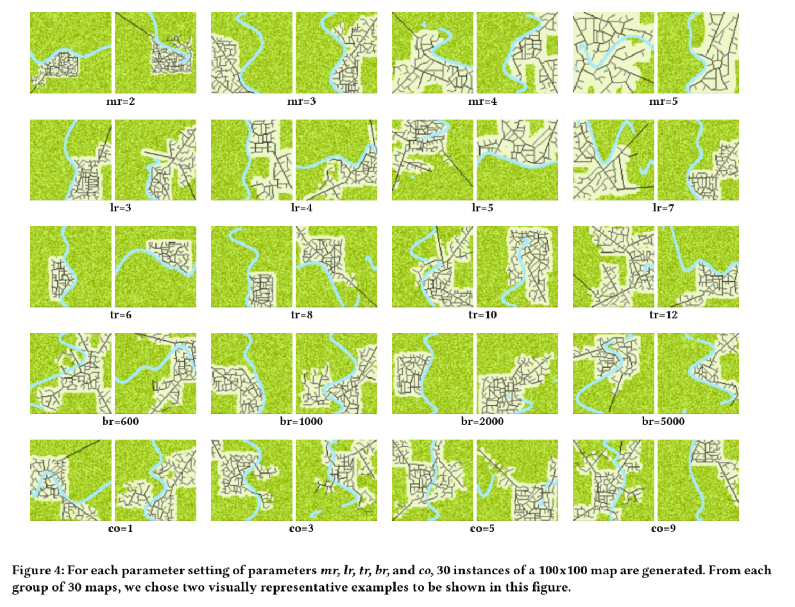

# town-sim-py
Ver. 1.1
Town growth simulator that creates road networks.

Outputs a text file which contains lists of roads, and if the road is curved, a list of its turning points. 

See paper [here](https://www.pcgworkshop.com/wp-content/uploads/2019/08/PCG2019_paper_7.pdf).

See presentation slides [here](TownSim_PCG_presentation.pdf).

## Expressive Range
Below are examples of the expressive range exposed by some of the parameters.



## Note
Use `-h` for up-to-date commandline options. Do not use `--noui`; it is out of sync.

## Commandline Options
```
usage: graph.py [-h] [--noui] [-o OUTPUT] [-s SIZE] [-c CYCLES] [-p2 PHASE2]
                [-p3 PHASE3] [-ma MAJOR] [-mi MINOR] [-by BYPASS]
                [-br BRIDGES]

optional arguments:
  -h, --help            show this help message and exit
  --noui                Suppresses UI if set.
  -o OUTPUT, --output OUTPUT
                        Output file name. Default: output.txt.
  -s SIZE, --size SIZE  n for nxn grid. Default: 200.
  -c CYCLES, --cycles CYCLES
                        The number of full cycles to run before ending
                        simulation in commandline. The simulation does not
                        self-terminate when running in UI. Default: 15.
  -p2 PHASE2, --phase2 PHASE2
                        Minimum total prosperity to allow calculation for
                        bypass roads. Default: 200000.
  -p3 PHASE3, --phase3 PHASE3
                        Minimum total prosperity to allow calculation for
                        minor roads. Default: 80000.
  -ma MAJOR, --major MAJOR
                        Minimum local prosperity for a new major road.
                        Default: 10.
  -mi MINOR, --minor MINOR
                        Minimum local prosperity for a new minor road.
                        Default: 400.
  -by BYPASS, --bypass BYPASS
                        Minimum local traffic for a new bypass segment.
                        Default: 2000.
  -br BRIDGES, --bridges BRIDGES
                        Minimum local prosperity for a new bridge. Default:
                        5000.
```
## Piping into SUMO format
We mirror-forked SUMO here allowing the town-sim output to be piped into the SUMO format (.net.xml): https://github.com/julinas/sumo-mirror making some minor changes to SUMO's netgenerate program. Edited files are netgen/NGEdge.* , netgen/NGNet.* , and netgen/NGFrame.* 

This is the added usage where filename1 should be the location of the file generated by town-sim-py and filename2 is the output location of the resulting .net.xml file.
```
netgenerate --town-sim --town-sim.file=[filename1] --output-file=[filename2]
```
Ex.
```
netgenerate --town-sim --town-sim.file="output.txt" --output-file="NewSUMOFile.net.xml"
```

## Bugs
The output function is set up such that the lists of road nodes and segments can be messed up if outputting twice in one simulation.

### "Technical Statement"
Below is the technical statement for this project, written for fulfillment of the Computational Media comprehensive exam at UC Santa Cruz.

This technical statement showcases an example of my experience in creating media using multi-agent system simulations. The goal of the TownSim project is to create realistic-looking road-networks. At a high level, this is done by allowing simulated agents to tread their own paths, resulting in naturalistic growth of roads. It is based on the idea that roads appear because people are going places. In the very beginning, roads literally appear in the ground when many people go along the same route. Later, roads are paved when there is a perceived need for people to travel along that route. TownSim uses a multi-agent system to simulate people going places; the agents “need” to go places because of operationalized simple needs of water and sustenance. The resulting road network is a record of agent activity rather than assigned development. Some elements of the simulation imitate unplanned, organic city growth, while other elements imitate grid-like city planning. Ideally, the map and the agents are updated in parallel every cycle, but in the code this is done successively in a random order. TownSim is implemented in Python and outputs images of the generated road network, as well as road network files compatible with the SUMO traffic simulator.

#### Gridworld
The sandbox is a 2-dimensional pixel map where each pixel is a node. Each node can contain a limited number of agents and is labeled with a set of types. These are the types that each node in the gridworld can hold: “greenfield”, “forest”, “water”, “building”, “road”, and “park”. There are subtypes of road, including “minor road”, “major road”, “bridge”, and “bypass”. The main node types are mutually exclusive, while the road types are not mutually exclusive. Minor roads represent two-lane roads, while major roads represent four-lane roads. Bridges are any roads over water, and bypasses are similar to real-world bypasses — roads meant to make a shorter connection between two points on an existing road that is winding and longer.

Nodes hold two properties: “prosperity” and “traffic”. Additionally, nodes hold two values that indicate the amount of “water” and “sustenance” resource each node contains. Water nodes yield “water”, while forest, greenfield, and building yield “sustenance”. “Forest” yields a little more sustenance than “greenfield”, while “building” yields an amount of sustenance that is calculated from prosperity. 

The decision to distinguish a park type is due to small, leftover bits of undeveloped, enclosed gaps in the middle of generated towns. The small gaps are too close to other roads for a new road to form, and don't fit the criteria to become a “building” type. If we leave them as forest/greenfield types, agents will continue to perform rural-like gathering activities on those nodes, which is undesirable. Therefore, we turn them into park types, which are the most common type of broadly vegetated area in the middle of a city.

Imitating a settlement phase, the map is seeded with a randomly placed patch of water nodes that follows the shape of a low-dimension polynomial and a small stretch of straight road and building area close to the water. The rest of the map is random-uniformly distributed with forest and greenfield types. 

In each time step, first, all agents update (more detail on that later); then, all map nodes update. The updates are implemented sequentially, re-randomizing the order each time. If prosperity and traffic values are above certain thresholds (prosperity and traffic increase as the result of agent activity — more details later), the type of the node can change: forest and greenfield types, which we call “unbuilt'' types, can become road, building, or park; building type nodes can become road. By default, major roads can be motivated by relatively low prosperity, while creating minor roads, bridges crossing water, and new lots for major roads that want to be created outside of existing lots, require relatively higher prosperity. Bypass-type roads are motivated by traffic. The thresholds for when the building of various road types triggered are controllable by exposed parameters in the software, which we discuss later. 

Lastly, prosperity and traffic decrease by decay factors, which are also exposed parameters.

#### Agents
In the “settlement phase'', 100 agents are each randomly placed into a building nodes. For each time step, each agent undergoes a sequential consume-work-trade-rest routine, a simplified version of basic human activities, although the time scale of the simulation does not follow day-to-day cycles. At the beginning of each time step, each agent consumes a fixed amount of water and sustenance. Next, for “work'', the agent chooses one resource type to gather depending on which stock is low. To gather, the agent randomly selects a node within its explorable range containing the wanted resource and moves to it.

Water is a non-depletable resource, while sustenance is depletable. For every time step, forest and greenfield nodes start with hard-coded amounts of sustenance, while the amount in building nodes increases with its current prosperity. 

After gathering, the agent randomly selects another agent in the same node, and trades if there is a trade profitable to both parties. An agent's valuation of each resource is determined by the ratio of the two resources in its stock (e.g., each water is worth x sustenance, and vice versa). If a trade occurs, the average between the agents' valuations is used as the price. Finally, the last action that an agent performs in a time step is rest: moving to a vacant building node within their explorable range. 

As a result of each agent movement, the prosperity of the destination node is increased, and the traffic of the midpoint node in the path is increased. An agent fails to survive if it cannot rest at the end of the cycle, or if either of their resources become negative. Instead of implementing a social system enabling reproduction and immigration, as a simplification, an agent with sufficient resources in a node with extra room can spontaneously spawn a new agent with half of its own resources.

#### Road Logic
Local prosperity is the sum of the prosperity of a node and all its neighbors. If local prosperity of a node reaches a minimum threshold, the program runs other checks to see if a road will be created. A minor road must be in an existing lot and near existing building nodes. If the local prosperity of a node outside existing lots is quite high, a major road can be built to it and a new lot created around it. The part of a major road that crosses over a body of water has the bridge type as well as the major road type, and the creation of this bridge requires yet higher local prosperity; as in reality, bridges are more expensive. 

There are also a few small adjustments before instantiating a road in the gridworld:
* Snap-to-grid: New road nodes that can be shifted units to make the resulting road exactly vertical or horizontal, would be shifted; this very loosely imitates planned streets that tend to be grid-like. 
* Major roads are extended toward the edge of the lot, expanding access to previously unexplored areas.
* Minor roads are extended a small amount to reach another street in the other direction, if possible; this essentially favors through streets over culs-de-sac.
